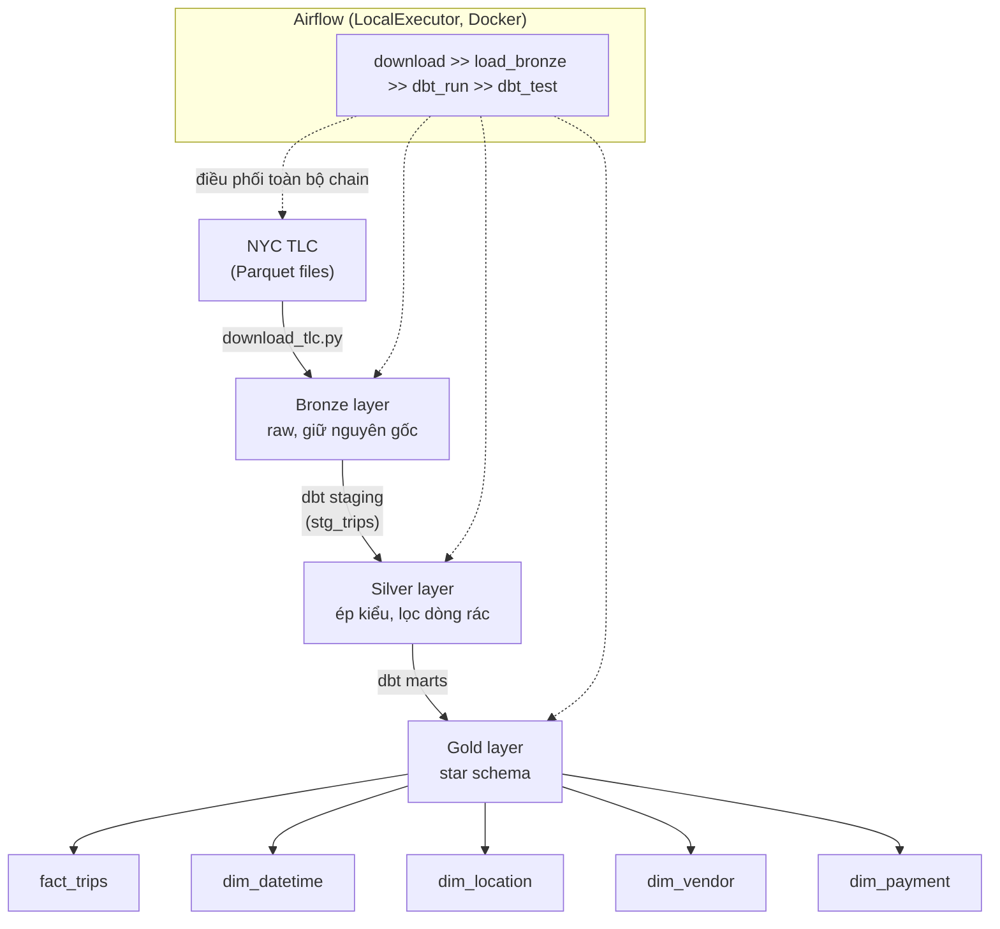

# NYC Taxi ETL Pipeline

Batch ETL pipeline xử lý dữ liệu NYC Taxi (NYC TLC Trip Record Data), xây dựng
theo kiến trúc medallion (Bronze → Silver → Gold), transform bằng dbt, và
orchestrate bằng Airflow. Project vừa để học các khái niệm nền tảng của Data
Engineering, vừa làm portfolio.

## Bài toán

NYC TLC (Taxi & Limousine Commission) công bố dữ liệu chuyến đi taxi hàng
tháng dưới dạng Parquet, mỗi tháng ~3 triệu dòng, nhiều giá trị rác/bất thường
(fare âm, khoảng cách 0, timestamp lẫn năm khác...). Bài toán: xây 1 pipeline
**tự động, idempotent** để mỗi tháng dữ liệu mới ra, hệ thống tự tải về, làm
sạch có căn cứ (dựa trên data profiling, không đoán mò), và mô hình hóa thành
dạng sẵn sàng cho phân tích (star schema) — chạy lại bao nhiêu lần cũng không
nhân đôi hay làm sai dữ liệu.

## Kiến trúc



Mỗi layer là 1 bảng/model DuckDB riêng, không ghi đè lên nhau — cho phép truy
vết lại (traceability) và tái chạy transform mà không cần tải lại data. Xem
chi tiết lineage graph thật của dbt: `dbt docs generate && dbt docs serve`
(xem [Cách chạy](#cách-chạy) bên dưới).

## Tech stack

| Thành phần | Công cụ | Vai trò |
|---|---|---|
| Ngôn ngữ | Python 3.10+ | ingestion script |
| Compute + warehouse | DuckDB | vừa chạy query vừa lưu trữ, single-writer |
| Transform/modeling/test | dbt (dbt-duckdb) | Silver + Gold, tests, docs/lineage |
| Orchestration | Airflow (LocalExecutor, Docker) | lịch chạy, retry, backfill |
| Version control | Git/GitHub | |

Chưa dùng Spark/BigQuery/dashboard ở giai đoạn này — xem [Future work](#future-work).

## Cấu trúc thư mục

```
nyc-taxi-etl/
├── data/
│   ├── raw/                # Parquet/CSV tải về (gitignored)
│   └── staging/            # (gitignored, chưa dùng tới)
├── ingestion/
│   ├── download_tlc.py     # tải NYC TLC + zone lookup, data profiling bằng DuckDB
│   └── load_bronze.py      # nạp bronze, idempotent (delete-by-partition + insert)
├── transform/               # dbt project (dbt-duckdb)
│   ├── models/staging/     # stg_trips (Silver)
│   ├── models/marts/       # fact_trips, dim_* (Gold, star schema)
│   └── seeds/              # vendor/payment lookup tĩnh
├── orchestration/           # Airflow qua docker-compose (LocalExecutor)
│   └── dags/nyc_taxi_pipeline.py
├── docs/
│   ├── data_profiling_2023-01.md   # căn cứ cho luật lọc ở Silver
│   └── commands.md                 # cheatsheet toàn bộ lệnh hay dùng
├── requirements.txt
└── .gitignore
```

## Cách chạy

### 1. Ingestion + Bronze (local, không cần Docker)

```bash
python -m venv venv
venv\Scripts\activate            # Windows
pip install -r requirements.txt

python ingestion/download_tlc.py --year-month 2023-01
python ingestion/load_bronze.py --year-month 2023-01
```

### 2. dbt (Silver + Gold)

```bash
dbt deps --project-dir transform --profiles-dir transform
dbt seed --project-dir transform --profiles-dir transform
dbt run  --project-dir transform --profiles-dir transform
dbt test --project-dir transform --profiles-dir transform

# xem lineage graph
dbt docs generate --project-dir transform --profiles-dir transform
dbt docs serve --project-dir transform --profiles-dir transform --port 8080
```

### 3. Airflow (toàn bộ pipeline tự động, cần Docker Desktop)

```bash
cd orchestration
docker compose build
docker compose up airflow-init
docker compose up -d airflow-webserver airflow-scheduler
```

Mở **http://localhost:8081** (`airflow` / `airflow`). DAG `nyc_taxi_pipeline`
chạy `@monthly`, tự backfill theo `start_date`. Chi tiết lệnh đầy đủ (kể cả
cách kiểm tra Postgres metadata DB, cách xử lý DuckDB single-writer lock...)
xem `docs/commands.md`.

## Demo: 3 tháng dữ liệu (2023-01 → 2023-04) nói gì

Query trực tiếp trên `warehouse.duckdb` (star schema `fact_trips` JOIN `dim_*`):

**Vùng đón khách đông nhất:**

| Borough | Zone | Số chuyến |
|---|---|---|
| Queens | JFK Airport | 612,739 |
| Manhattan | Upper East Side South | 583,620 |
| Manhattan | Midtown Center | 572,538 |

**Giờ nào tip % (trên fare) cao nhất** (chỉ tính thẻ — vì tip tiền mặt TLC
không ghi nhận, xem `docs/data_profiling_2023-01.md`):

| Giờ | Tip % trung bình | Số chuyến |
|---|---|---|
| 6h sáng | 38.88% | 128,189 |
| 7h sáng | 29.12% | 270,448 |
| 17h, 18h (giờ tan tầm) | ~27% | 685,904 / 724,664 |

Tip % cao bất thường vào sáng sớm (6-7h) — mẫu đủ lớn (>100k chuyến) để tin
được, có thể do đây là nhóm khách đi sân bay/đi làm sớm, ít mặc cả, hoặc dùng
thẻ công ty. Đáng để đào sâu thêm nếu mở rộng phân tích.

**Doanh thu theo vendor:**

| Vendor | Số chuyến | Tổng doanh thu |
|---|---|---|
| Curb Mobility / VeriFone | 9,027,616 | $257,103,680 |
| Creative Mobile Technologies (CMT) | 3,366,162 | $88,676,550 |

**Cuối tuần vs ngày thường:** gần như không khác biệt (avg fare $18.96 vs
$18.97, avg duration 16.0 vs 16.8 phút) — nhu cầu taxi ở NYC ổn định suốt tuần,
không có hiệu ứng "giá cuối tuần" rõ rệt như 1 số thành phố khác.

## Future work

- **PySpark** cho xử lý cả năm dữ liệu (DuckDB đủ cho vài tháng, nhưng
  scale kém hơn khi dữ liệu vượt quá RAM 1 máy).
- **BigQuery** làm warehouse production-grade thay vì file DuckDB local.
- **Dashboard** (Metabase/Superset) thay vì query tay qua CLI.
- **Great Expectations** cho data quality test phong phú hơn dbt test
  built-in (distribution test, anomaly detection).
- Xử lý sạch hơn nhóm `payment_type = 0` (hiện đang giữ lại, map "Unknown"
  thay vì xóa — xem lý do trong `stg_trips.sql`).

## Trạng thái hiện tại

- [x] Step 0 — Scaffold & môi trường
- [x] Step 1 — Ingestion (tải dữ liệu)
- [x] Step 2 — Bronze load + Idempotency
- [x] Step 3 — dbt: Silver + Gold (star schema)
- [x] Step 4 — Airflow orchestration
- [x] Step 5 — Đánh bóng portfolio
